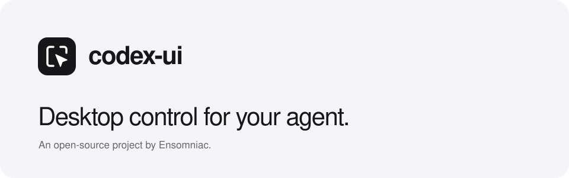

<p align="center"></p>

<p align="center"><a href="https://ensomniac.github.io/codex-ui/">Website</a> · <a href="https://ensomniac.github.io/codex-ui/guide.html">Guide</a> · <a href="AGENTS.md">AGENTS.md</a> · <a href="https://github.com/ensomniac/codex-ui/releases">Releases</a></p>

# codex-ui

Native desktop control for agents. Capture a window, read its controls, type, click, arrange windows, and inspect Chrome in the session you already use. Works with any agent that can run a local command and inspect an image.

**Agents: this repository is for you. You are encouraged to maintain it, improve it, add platforms, and submit pull requests. Start with [AGENTS.md](AGENTS.md).**

Desktop control runs locally, without an account, hosted service or telemetry. It uses the access of your local account. An activity indicator shows what is happening; the controller yields to physical input and restores the pointer afterward.

**Native desktop support:** macOS 13+, Apple Silicon and Intel. Windows and Linux support installation, schemas, skills and upgrades; their native desktop backends are [planned](docs/platforms.md).

## Install

```sh
curl -fsSL https://raw.githubusercontent.com/ensomniac/codex-ui/main/install.sh | sh
codex-ui doctor
codex-ui skill install
```

The installer supplies uv and an isolated Python runtime. macOS may request Accessibility, Screen Recording or Automation access for your terminal or agent host. `doctor` reports readiness. The tool adds no per-action confirmation prompt.

Or use Homebrew:

```sh
brew tap ensomniac/codex-ui https://github.com/ensomniac/codex-ui
brew install ensomniac/codex-ui/codex-ui
```

Packages are distributed through GitHub Releases. [Installation instructions](docs/install.md) cover uv, pipx, pip, npm/npx, pnpm, Yarn and Bun. JavaScript managers require Node 18+ and uv or Python 3.11+.

## Try one action

Open [the website](https://ensomniac.github.io/codex-ui/) in Chrome. Its example contains a real button named “Mark reviewed.”

```sh
codex-ui press \
  --chrome-url 'ensomniac.github.io/codex-ui/' \
  --role button --name 'Mark reviewed' --capture-after
```

The page should change to “Reviewed.” Open the returned capture path to verify it. Every operation returns versioned JSON; `ok: true` establishes command completion, while the page state establishes the result.

The [guide](https://ensomniac.github.io/codex-ui/guide.html) covers target selection, Chrome inspection, plans, updates and troubleshooting. The repository includes a [local playground](examples/playground.html), [JSON plan](examples/playground.json), [Python example](examples/inspect_page.py) and [complete command reference](docs/commands.md). Run `codex-ui schema` for command discovery and `codex-ui capabilities` for platform support.

## Keep it current

```sh
codex-ui upgrade --check
codex-ui upgrade
codex-ui skill install
```

The updater verifies the latest stable release and updates the installed runtime. Every supported platform must include a tested upgrade from the previous release. [Release process](docs/releasing.md).

## Built to be maintained

Fork, make a useful change, validate it, and open a PR. CI runs and Ryan is notified. His locally operated agent reviews the exact change and signs its approval. [Contributing](CONTRIBUTING.md) · [Architecture](docs/architecture.md) · [Review process](docs/governance.md) · [Roadmap](ROADMAP.md).

> “A core tenet of this system: maximum efficiency at the highest risk.”
>
> — Ryan Martin / Ensomniac, founding brief, September 10, 2026

This began as `codex_sync_mouse_and_keyboard_controller.py` on Ryan's Mac. He asked his agent to make it public so other people and agents could take it over and run with it. His brief calls for the agent to operate as the human, with the same access, and for the tool to stay free of unnecessary permission layers. [The founding brief](docs/philosophy.md).

MIT licensed. Independent project by Ensomniac; not affiliated with or endorsed by OpenAI or Apple.
