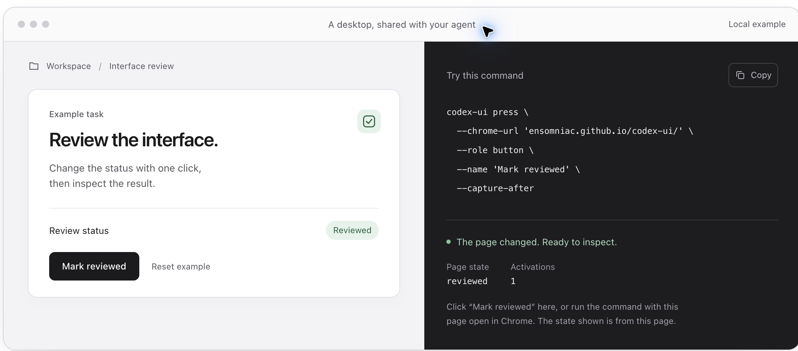

# A native click, with the result checked

These captures show the public browser example before and after the released `codex-ui 2.1.0` CLI pressed its button on macOS on September 25, 2026. Both are unaltered region captures from the visible desktop; browser tabs, account information, and the surrounding desktop are outside the captured region.

## Before


## Command

Open <https://ensomniac.github.io/codex-ui/?demo=github-readme> in Chrome. If necessary, use the [first-run guide](https://ensomniac.github.io/codex-ui/start.md) to install the tool and grant the macOS permissions it needs.

```sh
codex-ui press --chrome-url '?demo=github-readme' \
  --role button --name 'Mark reviewed' --capture-after
codex-ui inspect --chrome-url '?demo=github-readme' \
  --search 'Reviewed' --all
```

The selector was narrowed to this example tab. The CLI resolved the button through macOS Accessibility, clicked its frame once, and reported `ok: true`. The follow-up inspection returned a `static_text` element named exactly `Reviewed`.

## After



The browser example reports browser state. The JSON command result and the observed page establish different things: command completion and its visible effect. This demonstration verifies a native click and capture; it does not establish Chrome DOM inspection or native Windows/Linux support.

To repeat it, use **Reset example**, then run the commands again. Capture and inspect your own result; do not treat these recorded images as evidence for a later run.
